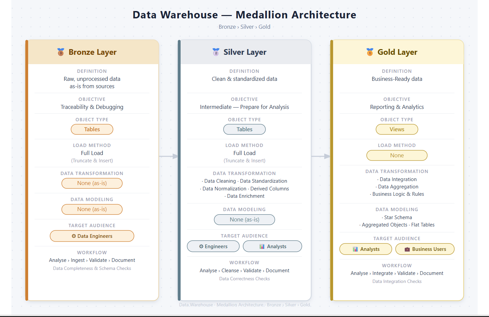

# 🏗️ Data Warehouse Project — SQL Server

> A production-style data warehouse built from scratch using SQL Server, implementing the **Medallion Architecture** (Bronze → Silver → Gold) to transform raw CRM and ERP source data into business-ready analytics.

---

## 📌 Project Overview

This project demonstrates end-to-end data engineering — from raw data ingestion through to a clean, analytics-ready Gold layer. It covers data architecture, ETL pipeline design, data modeling, and documentation best practices.

**What was built:**
- A fully layered data warehouse on SQL Server with `bronze`, `silver`, and `gold` schemas
- ETL stored procedures that load, cleanse, and transform data from two source systems
- A Star Schema dimensional model ready for BI tools and reporting
- Complete documentation including a data catalog, naming conventions, and architecture diagrams

---

## 🗂️ Repository Structure
```
├── datasets/
│   ├── source_crm/
│   │   ├── cust_info.csv          # Customer demographics
│   │   ├── prd_info.csv           # Product catalog
│   │   └── sales_details.csv      # Sales transactions
│   └── source_erp/
│       ├── CUST_AZ12.csv          # Customer birthdate & gender
│       ├── LOC_A101.csv           # Customer location data
│       └── PX_CAT_G1V2.csv        # Product category hierarchy
│
├── docs/
│   ├── data_catalog.md            # Column-level documentation for all Gold tables
│   ├── Naming Conventions.md      # Naming standards across all layers
│   ├── Data Architecture.png      # High-level architecture diagram
│   ├── Data Flow Diagram.png      # End-to-end data flow visualization
│   ├── Integration Model.png      # Source-to-target mapping
│   └── Sales Data Mart.png        # Star Schema model diagram
│
├── scripts/
│   ├── init_database.sql          # Creates database + bronze/silver/gold schemas
│   ├── bronze/
│   │   ├── ddl_bronze.sql         # Table definitions for raw ingestion layer
│   │   └── proc_load_bronze.sql   # Bulk insert from CSV → Bronze tables
│   ├── silver/
│   │   ├── ddl_silver.sql         # Table definitions for cleansed layer
│   │   └── proc_load_silver.sql   # ETL transforms Bronze → Silver tables
│   └── gold/
│       └── ddl_gold.sql           # View definitions for Star Schema (Gold layer)
│
├── tests/
│   └── quality_checks_silver.sql  # Data quality validation scripts for Silver layer
│
└── README.md
```

---

## 🏛️ Architecture

This project follows the **Medallion Architecture** — a layered approach that progressively refines data from raw ingestion to business-ready outputs.



| Layer | Schema | Object Type | Purpose |
|-------|--------|-------------|---------|
| 🥉 Bronze | `bronze` | Tables | Raw data ingested as-is from source CSV files |
| 🥈 Silver | `silver` | Tables | Cleansed, standardized, and enriched data |
| 🥇 Gold | `gold` | Views | Business-ready Star Schema for analytics |

---

## 🔄 Data Flow


**Two source systems feed the warehouse:**

- **CRM System** — customer profiles, product catalog, sales transactions
- **ERP System** — customer demographics, location data, product category hierarchy

Data moves through each layer via stored procedures:
```
CSV Files → [BULK INSERT] → Bronze → [ETL / proc_load_silver] → Silver → [Views] → Gold
```

---

## 📐 Data Model

The Gold layer implements a **Star Schema** optimised for analytical queries:


**Dimension Tables:**
- `gold.dim_customers` — Customer details enriched with geographic and demographic data
- `gold.dim_products` — Product catalog with category hierarchy, cost, and product line

**Fact Table:**
- `gold.fact_sales` — Transactional sales records linked to customers and products via surrogate keys

---

## 🛠️ Key Technical Decisions

**Surrogate Keys** — All dimension tables use `ROW_NUMBER()`-generated surrogate keys, decoupling the warehouse from source system identifiers.

**Full Load Strategy** — Both Bronze and Silver layers use Truncate & Insert on each pipeline run, ensuring idempotent and repeatable loads.

**Data Deduplication** — Silver layer uses `ROW_NUMBER() OVER (PARTITION BY ... ORDER BY ...)` to retain only the most recent record per entity.

**Gender Source Priority** — CRM is treated as the primary source for gender; ERP data is used as a fallback only when CRM value is `n/a`.

**Date Casting** — Raw integer date columns (stored as `YYYYMMDD INT`) in the sales source are validated and safely cast to `DATE` type in Silver.

---

## 🚀 How to Run

**Prerequisites:** SQL Server (any modern edition), SSMS or Azure Data Studio

**Step 1 — Initialise the database**
```sql
-- Creates DataWarehouse database + bronze, silver, gold schemas
exec scripts/init_database.sql
```

**Step 2 — Create table structures**
```sql
exec scripts/bronze/ddl_bronze.sql
exec scripts/silver/ddl_silver.sql
exec scripts/gold/ddl_gold.sql
```

**Step 3 — Load the data**
```sql
-- Load raw data from CSV files into Bronze
EXEC bronze.load_bronze;

-- Transform and load Bronze → Silver
EXEC silver.load_silver;
```

**Step 4 — Query the Gold layer**
```sql
-- Gold views are ready to query immediately
SELECT * FROM gold.dim_customers;
SELECT * FROM gold.dim_products;
SELECT * FROM gold.fact_sales;
```

---

## ✅ Data Quality

Quality checks are included in `tests/quality_checks_silver.sql` and cover:

| Check | Tables |
|-------|--------|
| NULL or duplicate primary keys | All Silver tables |
| Unwanted leading/trailing spaces | String columns |
| Invalid or out-of-range dates | Sales, customer birthdates |
| Illogical date ordering | Order → Ship → Due dates |
| Cross-field consistency | `sales = quantity × price` |
| Value standardization | Gender, marital status, country, product line |

---

## 📚 Documentation

| Document | Description |
|----------|-------------|
| [`data_catalog.md`](docs/data_catalog.md) | Column-level descriptions for all Gold layer tables |
| [`Naming Conventions.md`](docs/Naming%20Conventions.md) | Naming standards for all schemas, tables, columns, and procedures |
| [`Data Architecture.png`](docs/Data%20Architecture.png) | High-level architecture overview |
| [`Integration Model.png`](docs/Integration%20Model.png) | Source-to-target column mapping |

---

## 🧰 Tech Stack


- **Database:** Microsoft SQL Server
- **Language:** T-SQL (DDL, DML, Stored Procedures, Window Functions)
- **Methodology:** Medallion Architecture, Star Schema / Kimball-style modeling
- **Tooling:** SSMS, Git

---

## 👤 About

Built as a portfolio project to demonstrate practical data engineering skills including warehouse design, ETL development, data modeling, and documentation.

Feel free to connect or reach out with any questions.
